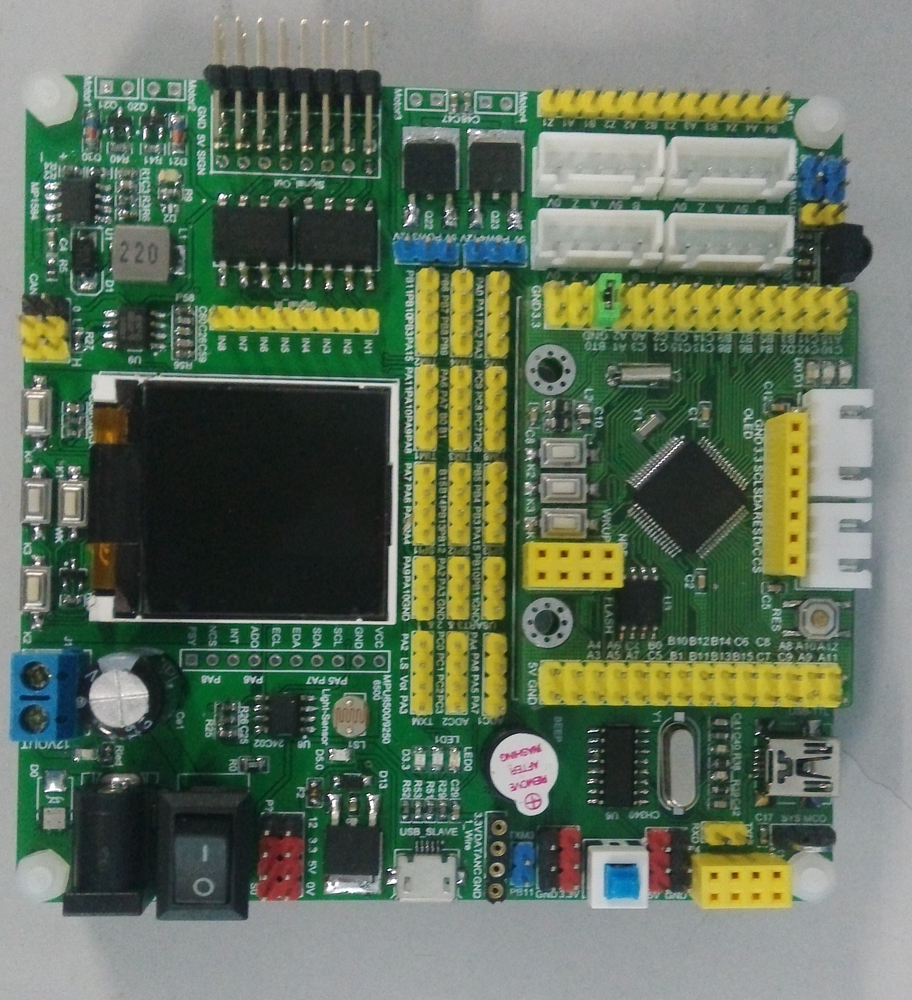
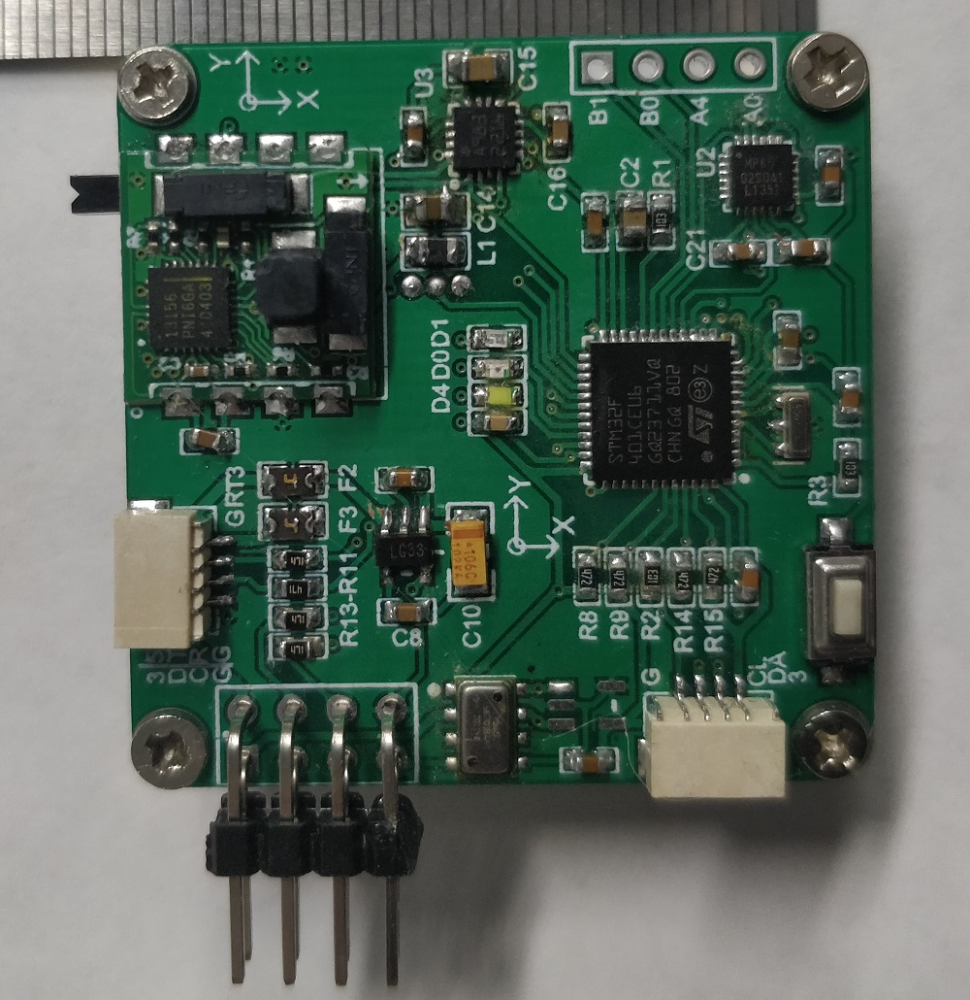
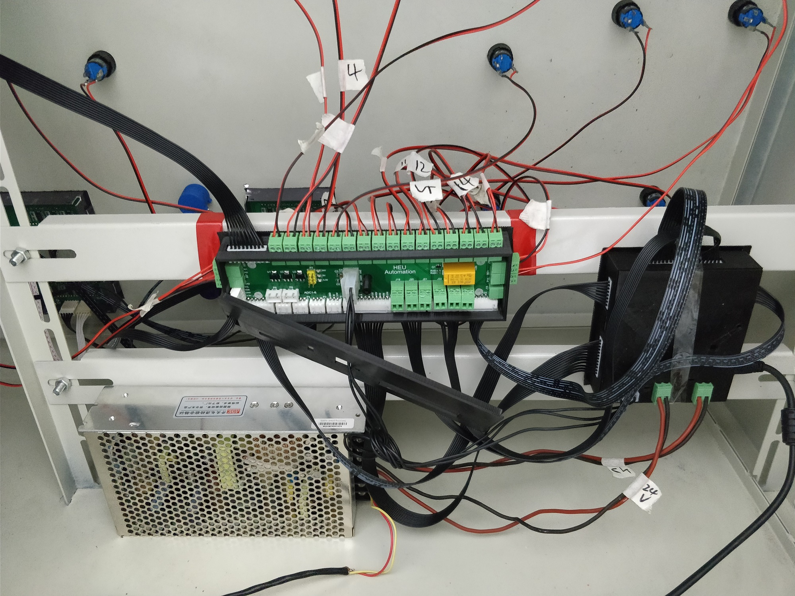
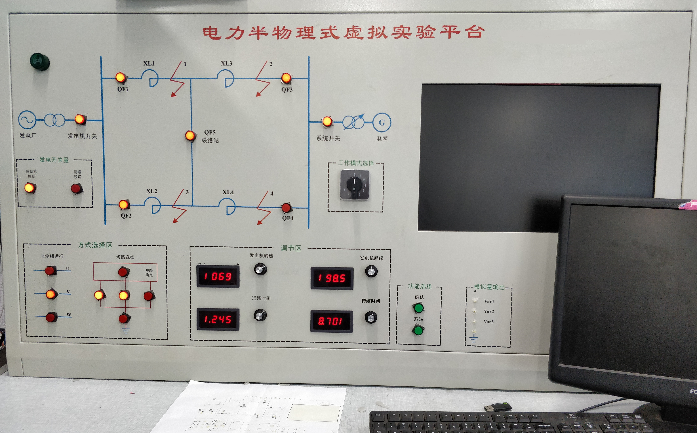
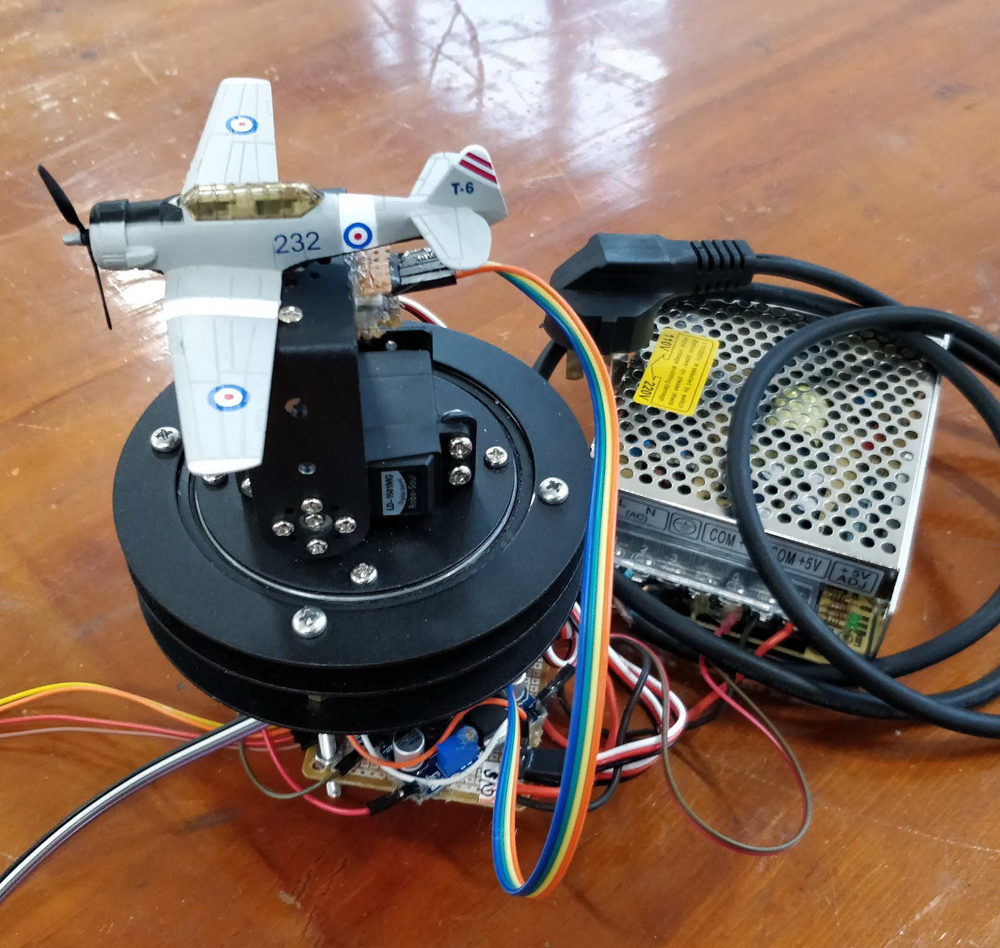
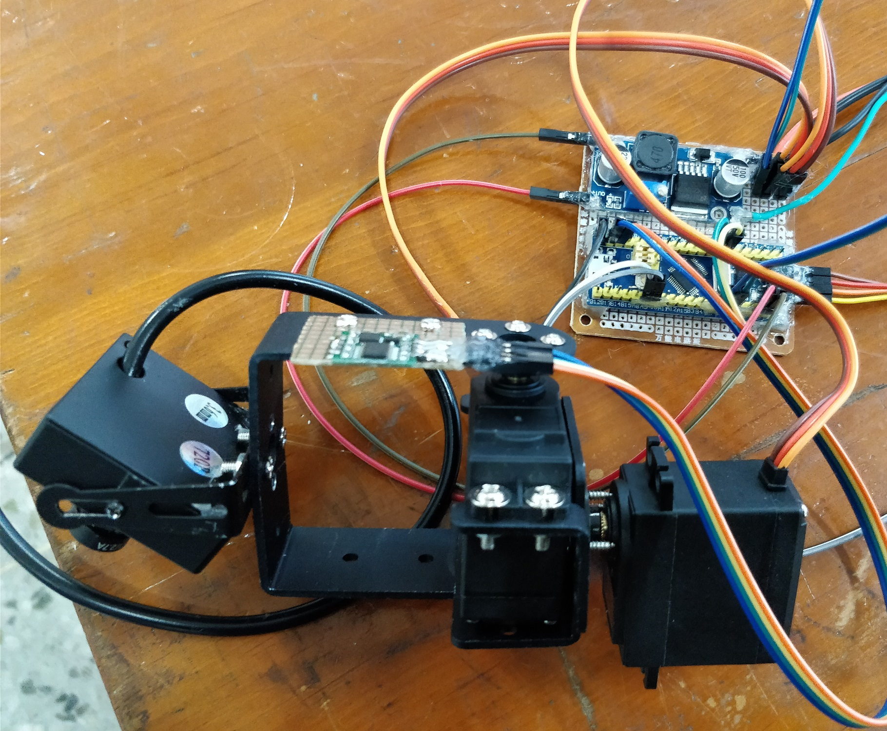
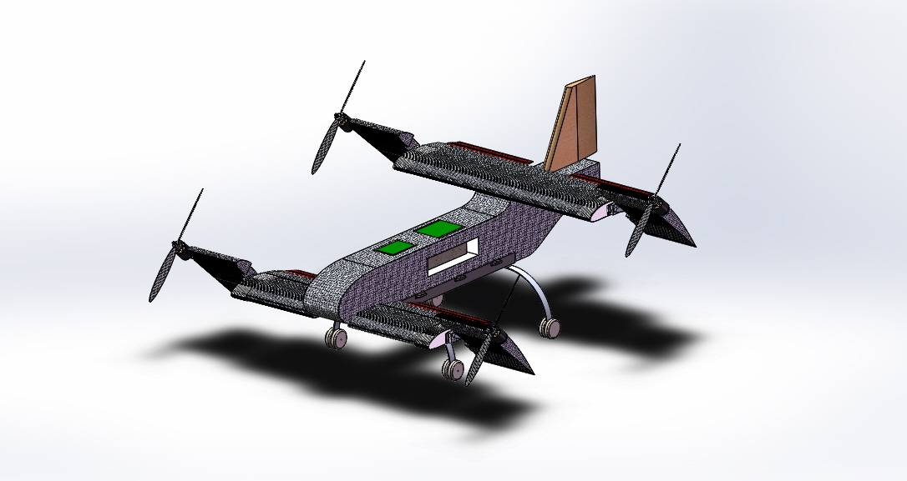
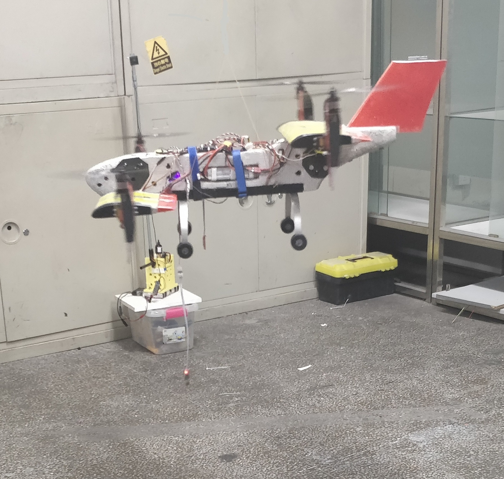
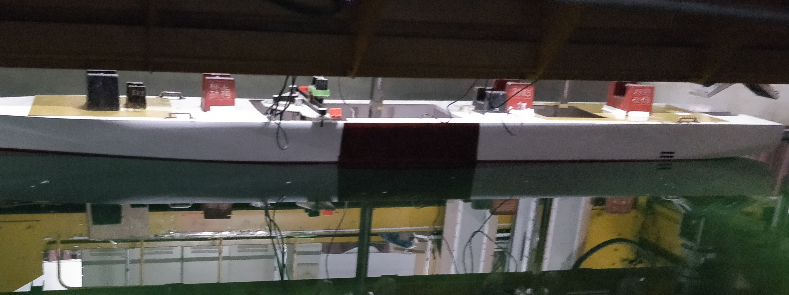

关键词:
 

控制系统综合设计，实验平台开发，

___

 2017.01-2017.04

**Project:**  学习板及电子模块设计制作

    
    

**Brief intro:**

15-16年做了大量的比赛，之后沉寂了半年，整理相关的技术，当时痴迷嵌入式系统硬件设计，集成设计了一些电子模块。一方面，在协会中做了控制部部长，平时要搞会员培训，做一些教程。另一方面，感觉之前做比赛很多时候比较凌乱，缺乏系统的规划，对于元件的选型基本是有啥用啥，哪个调通用哪个，最后做出来的东西能用，但不高效。所以决定沉淀一下技术。期间，开发了诸如STM32的学习板，电源系统模块，电机驱动模块，一些常用的传感器模块等，设计PCB，然后焊接，然后针对硬件开发相应的软件，乐此不疲。

**Outcomes:**

[部分电路板原理图和PCB文件已开源]([shizhuozhang/PCB_design-YKz (github.com)](https://github.com/shizhuozhang/PCB_design-YKz))

___

 2017.05-2017.08

**Project:**  电力仿真实验平台

**Brief intro:**

该项目为。

**Features:**

* 
* 

**Outcomes:**

调试过程的结果很好[项目的部分资料已开源]([shizhuozhang/17_eletricity_simu_platform-YkZ (github.com)](https://github.com/shizhuozhang/17_eletricity_simu_platform-YkZ))

___

 2017.09-2017.10

**Project:**  航天科工实习和保研

**Brief intro:**

该项目为。

___

 2017.11

**Project:**  云台和姿态角随动系统

    
    

**Brief intro:**

该项目为。

**Features:**

* STM32控制器。
* 

**Outcomes:**

调试过程的结果很好[实验代码、报告和视频演示结果]([shizhuozhang/17-Coursework-YkZ (github.com)](https://github.com/shizhuozhang/17-Coursework-YkZ))

___

 2017.11-2018.04

**Project:**  tilt-rotor 

**Brief intro:**

该项目为。

**Features:**

* STM32控制器。
* 

**Outcomes:**

调试过程的结果很好[该项目的部分代码、资料和测试视频已开源]([shizhuozhang/2018_quad-tilt-rotor-YkZ (github.com)](https://github.com/shizhuozhang/2018_quad-tilt-rotor-YkZ))

___

 2018.05-2018.06

**Project:**  船舶强迫横摇实验装置，交流伺服电机控制

**Brief intro:**

该项目为。

**Features:**

* STM32控制器。
* 

**Outcomes:**

调试过程的结果很好,[项目的代码和部分资料已开源]([shizhuozhang/18_vessel_rolling_simu-YkZ (github.com)](https://github.com/shizhuozhang/18_vessel_rolling_simu-YkZ))

