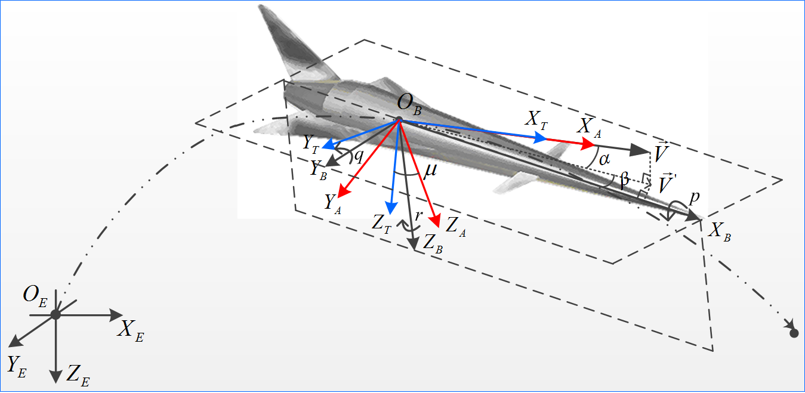

18年9月来到华科自动化学院飞导系，本想做无人机方向，继续tilt-rotor 的深入研究，谁知课题组无人机相关的项目是预研项目不需要太多人手，于是被分配到做高速飞行器项目方向。不过终归也还是飞行控制方向，依然做出了一些新的成果。

年度关键词:
 

飞行控制，控制算法，控制系统仿真

___

 2019.01

**Project:**  基于全向移动机器人平台和Kinect的二维SLAM

**Brief intro:**

该项目为华中科技大学研究生控制系统综合实验选题，。

**Features:**

* STM32控制器。
* 

**Outcomes:**

由于课程时间问题，系统中没有加入里程计，使得动态的地图构建结果不太理想。但系统的基本框架还是完善，算是SLAM入门的小尝试吧。 [项目资料和代码以开源到我的github.]([shizhuozhang/Test_2D_SLAM-YkZ (github.com)](https://github.com/shizhuozhang/Test_2D_SLAM-YkZ)) 

___

 2019.02-2019.09

**Project:**  运载火箭推力下降故障控制重构方法研究 (Control reconfiguration methods for space launch vehicle with thrust loss fault)

**Brief intro:**

该项目为。

**Features:**

* STM32控制器。
* 

**Outcomes:**

整理系统重构控制方面的工作，以第一作者发表期刊论文一篇；控制分配的方法参与发表会议论文一篇。[该项目的论文和部分代码片段在我的github上]([shizhuozhang/2019_FTC_SLV-YkZ (github.com)](https://github.com/shizhuozhang/2019_FTC_SLV-YkZ))

___

 2019.09-2019.10

**Project:**  飞行器控制性能评估方法和软件平台完善

**Brief intro:**

该项目为。

**Features:**

* STM32控制器。
* 

**Outcomes:**

调试过程的结果很好

___

 2019.11-2020.02

**Project:**  稳定与跟踪综合控制性能提升的姿态控制技术研究 (Research on the Aircraft Control Method for the Improvement of the Comprehensive Control Performance)

**Brief intro:**

该项目为。

**Features:**

* STM32控制器。
* 

**Outcomes:**

调试过程的结果很好[项目代码和论文专利资料。]([shizhuozhang/NN_Adp_GSC_HFV-YkZ (github.com)](https://github.com/shizhuozhang/NN_Adp_GSC_HFV-YkZ))

___

 2020.02-2020.08

**Project:**  物块分拣搬运小车

**Brief intro:**

该项目为。

**Features:**

* STM32控制器。
* 方法二[该方法的代码和论文资料]([shizhuozhang/Inst_Linr_Ctrl_HFV (github.com)](https://github.com/shizhuozhang/Inst_Linr_Ctrl_HFV))
* 方法三[该方法的代码和论文资料]([shizhuozhang/PPFSMC_HFV-YkZ (github.com)](https://github.com/shizhuozhang/PPFSMC_HFV-YkZ))

**Outcomes:**

方法三做了一些改进，将其整理成小论文，投稿到CJA，但被reject，后来考虑可能补充一些实际的实验结果会比较好（如四旋翼平台上的应用），但已经离校，又不想继续深入做仿真的改进，所以该论文只好暂时搁置，之后读博或者工作有合适的机会再尝试吧。。。
